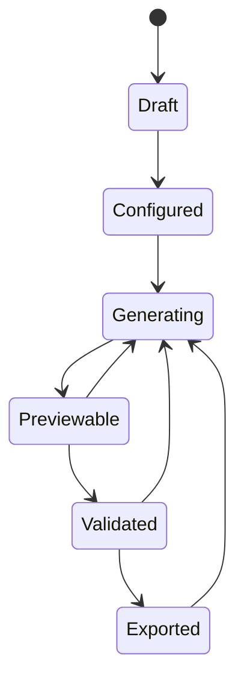
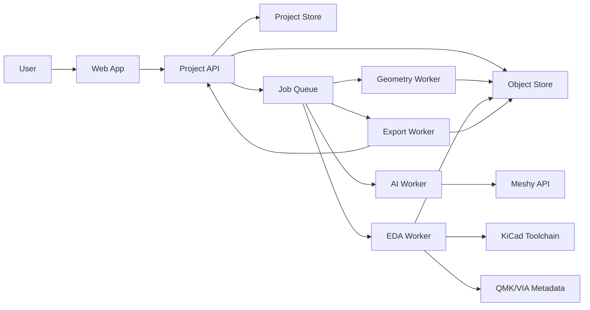

# BreakGen Product Specification

> Architecture-grade specification for an AI-assisted keyboard design and fabrication system.

## Document Metadata

| Field | Value |
| --- | --- |
| Product | BreakGen |
| Document type | Product + system architecture specification |
| Thesis context | NYU Tisch ITP, Spring 2025 |
| Current document revision | April 7, 2026 |
| Repository state | Documentation-only |
| Primary purpose | Define the product clearly enough to guide a serious rebuild |

## How To Read This Document

This spec intentionally separates three kinds of statements:

- `Prototype evidence`: what was observed or validated during the thesis prototype and exhibition
- `Architecture proposal`: how the system should be rebuilt as a maintainable product
- `External reference`: facts or constraints grounded in official documentation or vendor guidance

That separation matters. The original thesis succeeded because it proved the concept physically. A rebuild succeeds only if it turns that concept into a system with clear boundaries, deterministic outputs, and credible operational assumptions.

---

## 1. Executive Summary

BreakGen is a guided workflow for designing custom mechanical keyboards without requiring the user to operate the traditional keyboard toolchain directly. A user explores switch feel, describes keycap aesthetics in natural language, edits layout visually, and receives fabrication-ready outputs such as printable keycaps, plate geometry, PCB files, and firmware metadata.

The product is best understood as an intent compiler for hardware:

- users express creative and ergonomic intent
- BreakGen converts that intent into a canonical project model
- downstream compilers produce preview assets, geometry, PCB data, and export bundles
- validation gates decide whether the project is safe to fabricate

The central design decision is that AI should assist where ambiguity is valuable and creativity benefits from variation, while deterministic systems should own geometry, tolerances, electrical rules, and exports.

In practice, that means:

- AI may help generate keycap surface style
- layout, plate geometry, PCB matrix, manufacturing outputs, and validation should remain deterministic
- external toolchains such as KiCad and QMK should be treated as compilation targets, not user-facing authoring environments [R2][R3][R4]

---

## 2. Product Definition

### 2.1 One-Sentence Definition

BreakGen turns keyboard taste and intent into buildable artifacts.

### 2.2 Product Thesis

Anyone who can describe a keyboard should be able to design one.

### 2.3 Product Boundary

BreakGen is not a general-purpose CAD suite, not a general EDA suite, and not a pure generative art toy. It is a keyboard-specific product with opinions about what should remain flexible and what must remain constrained.

### 2.4 What the Product Must Do

- translate intent into a structured keyboard project
- preserve a high-quality real-time preview loop
- absorb the technical burden of keyboard-specific engineering
- produce outputs that can be fabricated with predictable results
- make validation visible so users trust the system

### 2.5 What the Product Does Not Need to Do in V1

- support every switch family, PCB topology, or wireless configuration
- expose arbitrary KiCad editing
- synthesize freeform enclosure geometry from unconstrained text
- replace specialist tools for expert users who want full manual control

---

## 3. Problem Definition

### 3.1 The Real Problem

The custom keyboard community has strong creative demand but high toolchain friction. Most users can articulate what they want in terms of feel, sound, layout, and visual identity. They fail when that intent must be translated into:

- schematic capture
- matrix planning
- PCB layout and manufacturing rules
- case and plate geometry
- firmware structure
- fabrication preparation

The current workflow often crosses Keyboard Layout Editor, CAD, KiCad, QMK, slicers, and manufacturer portals. Each handoff is a new coordinate system, a new file format, and a new failure mode [R2][R3][R10][R11].

### 3.2 Why Keyboards Are a Good Vehicle

Keyboards are a strong product domain for this thesis because they combine:

- subjective preference: sound, feel, visual identity
- constrained geometry: repeatable key pitch, switch footprints, plate cutouts
- constrained electronics: matrix scanning, diode direction, controller selection
- physical verification: the object can be fabricated, assembled, and tested

That makes the product falsifiable. Either the files manufacture correctly or they do not.

### 3.3 Jobs To Be Done

| User segment | Job statement |
| --- | --- |
| Aspiring enthusiast | "Help me turn a keyboard idea into something I can actually build." |
| Stalled intermediate builder | "Let me keep the creative parts and automate the engineering cliff." |
| Artist / designer | "Let me treat the keyboard as a physical canvas without learning EDA." |
| Advanced builder | "Let me move faster on layout-to-PCB without losing trust in the outputs." |

---

## 4. Users, Needs, and Product Value

### 4.1 Primary Users

| Segment | Existing skill | Pain | BreakGen value |
| --- | --- | --- | --- |
| New enthusiast | Taste, inspiration, low fabrication knowledge | Toolchain intimidation | Guided flow and exportable result |
| Intermediate builder | Understands parts and layouts | Stalls at PCB and firmware | Deterministic compilation from layout |
| Artist | Strong form and material sense | No keyboard engineering context | Natural-language style control and constrained manufacturability |

### 4.2 High-Value Outcomes

- users can go from idea to export bundle in one product
- the system retains a feeling of authorship rather than template lock-in
- manufacturing constraints are enforced without taking over the interface
- output files can be audited and re-generated from a known project revision

### 4.3 Critical User Trust Question

Users will not trust "fabrication-ready" unless the product makes the validation story legible. BreakGen must show:

- what was validated
- against which rules or calibration defaults
- what remains an assumption
- where the files came from

---

## 5. Product Goals, Non-Goals, and Success Criteria

### 5.1 Goals

| ID | Goal | Why it matters |
| --- | --- | --- |
| G1 | Collapse the fragmented workflow into one guided experience | Reduces abandonment between tools |
| G2 | Preserve creative expressiveness in style and layout | Prevents the product from feeling like a template generator |
| G3 | Keep manufacturing-critical outputs deterministic | Supports trust and reproducibility |
| G4 | Make validation a first-class surface | Replaces vague "production-ready" claims with evidence |
| G5 | Support a credible rebuild architecture | Prevents the thesis prototype from remaining a one-off demo |

### 5.2 Non-Goals

| ID | Non-goal | Reason |
| --- | --- | --- |
| NG1 | Full custom EDA editing in-browser | BreakGen should compile to EDA, not become EDA |
| NG2 | Fully freeform AI-generated case geometry in V1 | Mechanical risk is too high without stronger constraints |
| NG3 | Universal compatibility with every custom keyboard standard | The v1 product must be narrow enough to be trustworthy |
| NG4 | Replacing expert workflows for power users | Experts can still export and continue elsewhere |

### 5.3 Success Criteria

The rebuild should define success in measurable terms:

- a novice user can create a valid starter project without leaving the product
- a layout edit produces synchronized preview, geometry, and PCB recompilation from the same project revision
- the system can regenerate the same export bundle from stored project state and toolchain versions
- all downloadable bundles include a validation report and artifact manifest
- failures are reported with actionable reasons instead of silent fallback

---

## 6. Product Principles

### 6.1 AI Where Ambiguity Is Valuable

AI is useful when a user wants aesthetic variation from loose language. It is not trustworthy enough to own dimensions, fit, or electrical correctness by itself [R1].

### 6.2 Determinism Where Fabrication Depends on Precision

Plate cutouts, switch footprints, matrix topology, board outlines, and stem geometry should be generated from explicit rules or parameterized models, not from unconstrained generative output [R2][R3][R6][R8][R9].

### 6.3 One Canonical Source of Truth

The keyboard project model must be the source of truth. Meshes, KiCad files, Gerbers, previews, and manifests are derived artifacts.

### 6.4 Validation Must Be Visible

The product should not just say "passed." It should show categories such as geometry, fit, PCB rules, export completeness, and firmware consistency.

### 6.5 Scope Discipline Beats Feature Sprawl

The product becomes weaker if it promises:

- arbitrary split and sculpted geometries before the compiler is stable
- unlimited switch standards before footprints are validated
- deep AI generation in every subsystem before output integrity exists

---

## 7. User Experience Model

### 7.1 Guided Flow

The default user journey should be:

1. Start a project.
2. Choose a keyboard family or template.
3. Explore switch feel and select a switch profile.
4. Generate or choose keycap styling.
5. Edit the layout visually.
6. Compile geometry and PCB artifacts.
7. Review validation.
8. Export fabrication bundle.

### 7.2 Why the Flow Is Sequential

Beginners benefit from a narrow decision surface. The UX should be sequential, but the system beneath it must allow edits out of order. The user sees a guided path; the architecture sees a mutable project graph.

### 7.3 User-Facing States

| State | Meaning |
| --- | --- |
| Draft | Project exists but has not completed required setup |
| Configured | Layout, switch family, and style inputs are present |
| Generating | One or more async jobs are producing or updating assets |
| Previewable | Current project revision can be rendered and inspected |
| Validated | Current revision passed all required validation gates |
| Exported | Bundle created and stored |

### 7.4 State Machine



Any change that affects geometry, electronics, or exports should invalidate the previous validation result.

---

## 8. Functional Requirements

| ID | Requirement | Acceptance criteria |
| --- | --- | --- |
| FR1 | Project creation | User can create a keyboard project from blank or template |
| FR2 | Template system | Product offers a constrained set of supported layouts and families |
| FR3 | Switch exploration | User can compare switch profiles and select one supported footprint family |
| FR4 | Keycap style generation | User can submit a style prompt, view generated variants, and attach approved variants to keys or groups |
| FR5 | Layout editing | User can add, move, rotate, resize, and delete keys within supported constraints |
| FR6 | PCB compilation | Product compiles supported layouts into a keyboard-specific PCB project and reports status |
| FR7 | Geometry compilation | Product derives plate geometry, mounting references, and printable keycap assets |
| FR8 | Validation reporting | Product produces a machine-readable and human-readable validation report |
| FR9 | Export packaging | Product bundles all required outputs plus manifest and version metadata |
| FR10 | Revision traceability | Every artifact is tied to a project revision, toolchain versions, and validation result |

### 8.1 Recommended Scope Cut for V1

To keep the rebuild credible, V1 should constrain support to:

- MX-compatible switches first, with optional low-profile Choc support second [R8][R9]
- single-piece boards and simple split layouts before sculptural or deeply custom enclosures
- deterministic plate and case shells before AI-generated enclosure geometry
- QMK/VIA-compatible exports for supported matrices [R3][R4][R5]

---

## 9. Canonical Domain Model

### 9.1 Source-of-Truth Hierarchy

1. `KeyboardProject`
2. derived manifests and validation reports
3. binary artifacts such as meshes, KiCad projects, Gerbers, DXFs, and STLs

This hierarchy prevents the common failure mode where an exported board file or edited CAD model becomes the de facto source of truth.

### 9.2 Core Entities

| Entity | Description |
| --- | --- |
| `KeyboardProject` | Canonical project record |
| `LayoutSpec` | Key positions, sizes, rotations, group assignments, encoder positions |
| `SwitchProfile` | Supported switch family, part metadata, audio/profile metadata, footprint family |
| `StyleRequest` | User prompt, presets, provider metadata, generation parameters |
| `KeycapAsset` | Generated or selected mesh asset plus normalization metadata |
| `PCBSpec` | Matrix plan, controller choice, footprint mapping, board outline links |
| `ValidationReport` | Result of geometry, manufacturing, and consistency checks |
| `ExportBundle` | Final deliverable package plus manifest |

### 9.3 Example `KeyboardProject`

```json
{
  "project_id": "bg_01HZX9Y7GQ7S2",
  "revision": 12,
  "status": "previewable",
  "created_at": "2026-04-07T15:20:00Z",
  "template": "65_percent",
  "layout": {
    "unit_pitch_mm": 19.05,
    "keys": [
      {
        "id": "k_esc",
        "label": "Esc",
        "x_u": 0,
        "y_u": 0,
        "w_u": 1,
        "h_u": 1,
        "rotation_deg": 0,
        "keycap_asset_id": "asset_alpha_01"
      }
    ]
  },
  "switch_profile": {
    "family": "mx",
    "part_id": "cherry_mx_red"
  },
  "style_request": {
    "provider": "meshy",
    "prompt": "weathered brass with subtle patina and cast texture",
    "variant_count": 4
  },
  "pcb": {
    "controller": "rp2040",
    "matrix_mode": "diode",
    "diode_direction": "COL2ROW"
  },
  "exports": {
    "bundle_id": null
  }
}
```

### 9.4 Required Invariants

- every key must map to exactly one supported switch footprint
- every large stabilized key must declare a stabilizer strategy
- every exported PCB revision must point back to the exact layout revision that produced it
- validation is revision-specific and expires on any material edit
- generated assets must carry provider and pipeline metadata for auditability

---

## 10. Target System Architecture

### 10.1 High-Level Shape



### 10.2 Service Responsibilities

| Component | Responsibility |
| --- | --- |
| Web app | UX, scene rendering, layout editing, review surfaces |
| Project API | CRUD, revision control, orchestration entry points, auth boundary |
| Project store | Canonical project data and revision history |
| Object store | Binary artifacts and export bundles |
| Job queue | Async work coordination and retries |
| AI worker | Prompt assembly, provider calls, task polling, raw asset ingest |
| Geometry worker | Mesh repair, shell fitting, stem application, plate/case derivation |
| EDA worker | Matrix synthesis, KiCad project generation, DRC, Gerber export |
| Export worker | Manifest creation, validation report collation, bundle packaging |

### 10.3 Architectural Recommendation

Do not build BreakGen as a browser-only app if the goal is credible fabrication outputs. Geometry operations, KiCad compilation, DRC, and bundle generation belong in backend workers or controlled local services, not in fragile client-only logic.

### 10.4 Suggested Technology Direction

The exact stack is replaceable, but the service boundaries should remain stable:

- React + Three.js for the web app
- typed API service for project CRUD and orchestration
- durable queue for async jobs
- dedicated geometry service with real mesh processing libraries
- dedicated KiCad integration service or worker
- object storage for versioned artifacts

### 10.5 Key Architectural Rule

KiCad projects are outputs, not the primary model. If the rebuild allows manual KiCad edits to become authoritative, the system loses reproducibility immediately [R2].

---

## 11. Subsystem: AI Keycap Generation

### 11.1 Purpose

This subsystem converts natural-language aesthetic input into candidate keycap surface styles.

### 11.2 External Constraint

Meshy exposes task-based text-to-3D generation with preview and refine stages, plus task retrieval and streaming support [R1]. That is useful for asynchronous generation, but the raw output is not manufacturing-safe by default.

### 11.3 Recommended Pipeline

1. Collect user prompt and optional style preset.
2. Wrap the prompt with keyboard-specific context.
3. Submit a generation task to the provider.
4. Retrieve raw mesh assets and metadata.
5. Normalize, repair, and evaluate the result.
6. Either:
   - accept the result as a candidate style asset, or
   - reject it and request regeneration.
7. Apply the approved style to a deterministic keycap shell.

### 11.4 Stronger Rebuild Recommendation

The prototype model of "AI generates the whole printable keycap" is visually compelling but mechanically fragile. The more robust rebuild architecture is:

- keep a deterministic keycap shell for each supported profile and unit size
- use AI output as surface inspiration, displacement source, or decorative geometry
- keep stem, wall thickness, key pitch, and mounting geometry under deterministic control

This reduces mesh brittleness and makes manufacturing behavior more predictable.

### 11.5 Prompt Contract

The prompt contract should store:

- raw user prompt
- system wrapper prompt
- provider name and model version
- generation parameters
- moderation or safety flags if enabled
- returned task ids and asset ids

### 11.6 Failure Modes

| Failure | Impact | Mitigation |
| --- | --- | --- |
| Broken topology | Mesh cannot be printed or booleaned | Automated repair attempt, otherwise reject |
| Wrong scale or orientation | Asset cannot fit deterministic shell | Normalize transforms before review |
| Visually interesting but mechanically impossible | User loses trust after export | Separate style approval from manufacturability approval |
| Provider latency or outage | Flow stalls | Async job states, retries, provider abstraction |

### 11.7 Acceptance Rules

A keycap asset should not be marked exportable until:

- topology checks complete
- minimum wall and cavity rules pass
- stem fit strategy is assigned
- the asset has been mapped to a supported unit size

---

## 12. Subsystem: Layout, Plate, and Case Geometry

### 12.1 Layout Model

The layout editor should operate on keyboard units and explicit rotations, similar to established keyboard layout tooling [R10][R11]. Each key stores:

- position
- dimensions
- rotation
- switch family
- stabilizer requirement
- assigned style asset or style group

### 12.2 Layout as the Backbone

The layout is the backbone for:

- preview placement
- plate cutouts
- PCB switch placement
- firmware matrix metadata
- enclosure sizing

If multiple subsystems maintain separate copies of layout geometry, the rebuild will drift and validation will become unreliable.

### 12.3 Plate Generation

Plate geometry should be derived deterministically from:

- key positions
- switch family
- supported stabilizer strategy
- edge margin rules
- mounting strategy

For V1, plate generation should stay inside a constrained ruleset instead of allowing unconstrained sketch editing.

### 12.4 Case Generation

Case generation should be scoped carefully.

Recommended V1:

- derive a parametric shell from plate and PCB outlines
- support a limited family of case archetypes
- keep mounting points, clearances, and port positions explicit

Deferred:

- unconstrained AI-generated case shapes
- highly sculptural ergonomic shells without deeper mechanical verification

### 12.5 Mechanical Constraints

The implementation should model switch-family-specific constraints from vendor documentation, especially around switch size, travel, mounting, and profile assumptions [R8][R9]. Manufacturing defaults and tolerances that come from thesis prototype calibration must be labeled as empirical rather than universal truth.

---

## 13. Subsystem: PCB and Firmware Compilation

### 13.1 Role

This subsystem turns the layout model into a keyboard-specific PCB project and matching firmware metadata.

### 13.2 External Constraints

- KiCad is the target PCB authoring and export environment [R2]
- QMK defines matrix-oriented firmware structures and data-driven keyboard metadata [R3][R4]
- VIA defines expectations for runtime remapping compatibility [R5]
- fabrication defaults should respect manufacturer capability guidance such as JLCPCB rules [R6][R7]

### 13.3 Recommended Compilation Strategy

Do not start with a general-purpose autorouter mindset. Keyboard PCBs are repetitive, structured, and constraint-rich. A better v1 architecture is:

1. derive matrix groups from layout
2. assign rows and columns using a predictable heuristic
3. place known footprints from a curated library
4. route using keyboard-specific strategies and escape rules
5. emit KiCad project files
6. run DRC and export manufacturing files

That is more controllable than relying on a generic autorouter for first principles.

### 13.4 Input Requirements

Minimum required inputs:

- supported switch family
- canonical layout positions
- controller family
- diode direction
- mounting and connector assumptions

### 13.5 Output Set

- KiCad project files
- Gerbers
- Excellon drill files
- BOM / part manifest
- controller and matrix metadata for firmware
- QMK/VIA-facing configuration artifacts where applicable [R3][R4][R5]

### 13.6 Scope Boundaries for V1

Support first:

- wired boards
- 2-layer FR4
- curated controller options such as RP2040
- diode matrix scanning
- constrained footprint library

Defer:

- wireless power management
- battery compartments
- hotswap variants across many footprints
- flex PCBs or complex multi-board assemblies

### 13.7 Validation Gates

The PCB should not be exportable until:

- schematic and board generation both succeed
- DRC passes
- board outline and plate assumptions match
- connector and mounting locations are coherent with case geometry
- firmware metadata aligns with row/column assignments

---

## 14. Subsystem: Preview and Interaction

### 14.1 Purpose

The preview is not only decorative. It is the user's primary trust surface before fabrication.

### 14.2 Responsibilities

- visualize layout changes immediately
- show keycap style assignments clearly
- expose problem states such as collisions, unsupported geometry, or failed assets
- maintain enough visual fidelity for decision-making without sacrificing responsiveness

### 14.3 Performance Strategy

The preview engine should use:

- instancing where repeated geometry is possible
- LOD or simplified preview assets for large layouts
- separate high-resolution export assets from viewport assets
- incremental updates rather than full scene rebuilds when possible

### 14.4 What the Preview Must Never Imply

It must never imply that a visually correct render is automatically fabrication-safe. Validation status must remain separate from visual polish.

---

## 15. Export Bundle and Validation Report

### 15.1 Export Package

The export worker should generate a structured bundle similar to:

```text
BreakGen_Export/
  manifest.json
  validation_report.json
  BUILD_GUIDE.md
  preview/
    hero.png
  keycaps/
    keycap_*.stl
  plate/
    plate.dxf
  pcb/
    gerbers/*
    drills/*
    bom.csv
    assembly_notes.md
  firmware/
    info.json
    keymap.json
    via.json
```

### 15.2 Manifest Requirements

The manifest should record:

- project id
- revision id
- creation timestamp
- toolchain versions
- provider versions
- artifact hashes
- validation report id

### 15.3 Validation Report Requirements

The validation report should include explicit categories:

- geometry integrity
- printable asset readiness
- plate and case constraint checks
- PCB DRC and manufacturability
- firmware metadata consistency
- export completeness

### 15.4 Example `validation_report.json`

```json
{
  "project_id": "bg_01HZX9Y7GQ7S2",
  "revision": 12,
  "status": "pass",
  "checks": [
    {
      "id": "pcb_drc",
      "status": "pass",
      "details": "KiCad DRC completed with no rule violations."
    },
    {
      "id": "keycap_wall_thickness",
      "status": "warn",
      "details": "Two novelty caps rely on empirical resin default of 1.2 mm."
    }
  ]
}
```

---

## 16. Fabrication Verification Strategy

### 16.1 Digital Validation Is Necessary but Not Sufficient

Passing DRC or mesh repair does not prove the final object will feel right, fit right, or survive fabrication. Digital validation proves consistency with known rules. Physical validation proves the rules were worth trusting.

### 16.2 Required Validation Layers

| Layer | Purpose |
| --- | --- |
| Geometry checks | Detect manifold issues, impossible booleans, unsupported sizes |
| Mechanical checks | Detect stabilizer, stem, clearance, and enclosure conflicts |
| PCB checks | Detect rule violations, missing nets, impossible routing states |
| Export checks | Verify required files and metadata exist |
| Physical calibration | Confirm defaults such as fit tolerance or wall-thickness assumptions |

### 16.3 Prototype Evidence

The thesis prototype established credibility through physical outputs rather than only simulation. Internal prototype evidence includes:

- fabricated keyboards displayed publicly
- repeated PCB iterations
- plate fabrication across multiple materials
- printed keycap experimentation and fit calibration

These are valuable, but a rebuild should capture such evidence in structured validation notes instead of leaving it in memory or presentation slides.

### 16.4 Truth Model for Rebuild

BreakGen should distinguish:

- `vendor-derived constraints`: from official documentation [R2][R3][R6][R8][R9]
- `prototype-calibrated defaults`: learned from fabrication tests
- `user-overridden assumptions`: consciously accepted deviations

That separation makes the system auditable.

---

## 17. Non-Functional Requirements

### 17.1 Performance

| ID | Target |
| --- | --- |
| NFR1 | Layout edits reflect in preview fast enough to preserve direct manipulation |
| NFR2 | Async generation jobs acknowledge immediately and expose progress states |
| NFR3 | Preview assets are optimized separately from export assets |

### 17.2 Reliability

| ID | Target |
| --- | --- |
| NFR4 | Failed jobs are retryable without corrupting project state |
| NFR5 | Artifacts are immutable per revision |
| NFR6 | Re-exporting the same revision yields the same manifest-level outputs |

### 17.3 Auditability

| ID | Target |
| --- | --- |
| NFR7 | Every generated asset records provider, version, and prompt metadata |
| NFR8 | Every export bundle records toolchain versions and validation status |

### 17.4 Security and Privacy

BreakGen handles prompts, generated assets, and potentially user-uploaded references. The rebuild must decide:

- what is stored permanently
- what is sent to third-party providers
- whether prompts or generated designs are private by default
- how export artifacts are retained or deleted

Provider usage must be explicit because AI generation depends on external APIs [R1].

### 17.5 Abuse and IP Considerations

The system should define policy around:

- copyrighted reference material in prompts or uploads
- generated outputs that resemble branded or protected designs
- unsafe or disallowed content routed to providers

Even if these concerns are light in the thesis phase, they become real product requirements in a rebuild.

---

## 18. Risks, Assumptions, and Open Questions

| Category | Risk or question | Why it matters | Mitigation or stance |
| --- | --- | --- | --- |
| AI geometry | Raw generated meshes may be unusable | Breaks manufacturability promise | Treat AI output as style input, not final truth |
| Toolchain drift | KiCad or provider APIs may change | Breaks reproducibility | Version-lock workers and record toolchain metadata |
| Scope creep | Trying to support every keyboard pattern too early | Makes validation shallow | Narrow V1 support matrix |
| Mechanical tolerance | Fit varies by printer, resin, and switch batch | Affects user trust | Separate vendor constraints from empirical defaults |
| PCB automation | Exotic layouts may challenge compiler assumptions | Can cause routing or firmware failures | Start with rule-based supported families |
| User trust | Beautiful preview can mask manufacturing uncertainty | Leads to broken expectations | Show validation status independently from rendering |

Open questions for the rebuild:

- Should the first serious implementation be cloud-hosted, local-first, or hybrid?
- How much manual override should advanced users get before the project loses determinism?
- Is keycap AI best handled as freeform mesh generation or as ornamentation on deterministic shells?
- Which exact controller and footprint library should define the supported hardware baseline?

---

## 19. Delivery Plan for a Serious Rebuild

### Phase 0: Canonical Model and Scope Cut

Deliver:

- `KeyboardProject` schema
- supported layout family list
- supported switch/controller matrix
- artifact manifest and validation schema

Exit criteria:

- all downstream systems consume the same project schema

### Phase 1: Layout + Preview Foundation

Deliver:

- template library
- layout editor
- preview scene
- revisioning

Exit criteria:

- layout edits are stable, persistent, and previewable

### Phase 2: Deterministic Geometry Compiler

Deliver:

- plate generation
- keycap shell library
- AI style job pipeline
- normalized keycap asset application

Exit criteria:

- supported projects produce geometry with repeatable validation results

### Phase 3: PCB + Firmware Compiler

Deliver:

- controller and matrix compiler
- KiCad emission
- DRC execution
- QMK/VIA metadata generation

Exit criteria:

- supported layouts compile into passing PCB outputs

### Phase 4: Export, Validation, and Fabrication Loop

Deliver:

- bundle packaging
- validation report
- fabrication notes
- feedback capture from physical builds

Exit criteria:

- exports are traceable, complete, and physically reviewable

---

## 20. Recommended Documentation Set Beyond This File

This spec should eventually be complemented by:

- a `SCHEMA.md` or machine-readable JSON schema for `KeyboardProject`
- an `ARCHITECTURE_DECISIONS.md` log for major trade-offs
- a `VALIDATION_RULES.md` document explaining each check category
- a `FABRICATION_CALIBRATION.md` log for empirical tolerance findings
- a `SUPPORTED_CONFIGS.md` matrix listing what the compiler actually supports

Those documents turn a good spec into an operable system.

---

## 21. References

All external references below were accessed on April 7, 2026.

- [R1] Meshy, "Text to 3D API." https://docs.meshy.ai/api/text-to-3d
- [R2] KiCad Documentation. https://docs.kicad.org/
- [R3] QMK Firmware Documentation. https://docs.qmk.fm/
- [R4] QMK Firmware, "info.json Reference." https://docs.qmk.fm/reference_info_json
- [R5] VIA Documentation, "Specification." https://www.caniusevia.com/docs/specification/
- [R6] JLCPCB, "PCB Capabilities & Instructions." https://jlcpcb.com/help/catalog/187-PCB%20Capabilities%20%26%20Instructions
- [R7] JLCPCB, "How do I order a panel?" https://jlcpcb.com/help/article/how-do-i-order-a-panel
- [R8] Cherry MX Series Datasheet mirror via DigiKey. https://www.digikey.jp/ja/htmldatasheets/production/57428/0/0/1/mx-series.html
- [R9] Kailh, "Choc V2 Low Profile Silent Tactile Switch." https://www.kailhswitch.com/mechanical-keyboard-switches/low-profile-key-switches/choc-v2-low-profile-silent-tactile-switch.html
- [R10] Ergogen Documentation. https://docs.ergogen.xyz/
- [R11] Keyboard Layout Editor Repository. https://github.com/ijprest/keyboard-layout-editor

---

## Appendix A. Sample Export Manifest

```json
{
  "bundle_id": "bundle_01J0ABCD1234",
  "project_id": "bg_01HZX9Y7GQ7S2",
  "revision": 12,
  "created_at": "2026-04-07T18:30:00Z",
  "toolchain": {
    "meshy": "latest",
    "kicad": "pinned",
    "qmk_schema": "pinned"
  },
  "artifacts": [
    {
      "path": "pcb/gerbers/top_copper.gbr",
      "sha256": "..."
    },
    {
      "path": "keycaps/keycap_alpha_a.stl",
      "sha256": "..."
    }
  ],
  "validation_report_id": "vr_01J0EFGH5678"
}
```

## Appendix B. What Was Missing From the Earlier Draft

The earlier documentation had strong thesis framing but weak systems framing. Specifically, it lacked:

- an explicit boundary between prototype evidence and future architecture
- canonical source-of-truth rules
- requirements with acceptance criteria
- clear scope cuts for a credible v1
- provenance and reproducibility requirements
- validation and export schemas
- a references section tied to real external documentation

This revision fixes those gaps so the docs can guide implementation instead of only describing intent.
