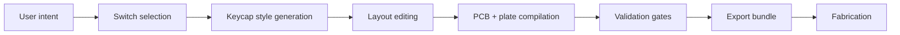

# BreakGen

> A spec-first product and system design for turning keyboard intent into fabrication-ready artifacts.

BreakGen began as an NYU ITP thesis project shown in Spring 2025. The core idea is simple: most people can describe the keyboard they want, but very few can move cleanly from taste and intent through CAD, PCB design, firmware configuration, and fabrication. BreakGen treats that gap as a product problem, not a user problem.

This repository currently documents the product, architecture, validation model, and rebuild direction. It is not yet a production codebase.

## What BreakGen Is

BreakGen is an AI-assisted workflow for custom mechanical keyboards. A user describes what they want a board to feel like and look like, arranges the layout visually, and receives a validated export bundle for fabrication.

The important architectural idea is that BreakGen is not just "AI for keyboards." It is two systems joined together:

1. An intent-capture layer for aesthetics, feel, and layout.
2. A manufacturing compiler that turns those choices into deterministic geometry, PCB data, firmware metadata, and export artifacts.

That distinction matters. AI can help generate visual variety, but manufacturability still depends on deterministic geometry, constraints, and validation.

## Product Thesis

Anyone who can describe a keyboard should be able to design one.

BreakGen removes the technical gatekeeping between a user's idea and a buildable result by hiding toolchain complexity behind a guided experience:

- switch exploration instead of raw spec-sheet comparison
- natural-language keycap style generation instead of manual 3D modeling
- visual layout editing instead of config-file-first tooling
- compiled PCB output instead of direct exposure to schematic editors
- validation before export instead of discovering fabrication errors after ordering

## Why This Exists

The existing custom keyboard workflow is fragmented. Even a straightforward custom build commonly crosses layout tools, CAD, PCB design tools, firmware configurators, slicers, and fabrication portals. The current ecosystem is powerful, but it assumes the user can already translate creative intent into engineering artifacts.

BreakGen is aimed at three user groups:

- aspiring enthusiasts with taste but no EDA or CAD background
- intermediate builders who can spec a board but stall at PCB and firmware
- artists and designers who want a keyboard as a physical object without learning a full electronics workflow

## Product Boundary

BreakGen should be explicit about what is proven, what is proposed, and what remains out of scope.

| Layer | Status | Notes |
| --- | --- | --- |
| Thesis prototype | Proven in physical exhibition | Validated the end-to-end concept with fabricated keyboards and public demos |
| Documentation and architecture | Current repo focus | This repository defines the target product and rebuild direction |
| Production SaaS | Not yet built | Authentication, storage, jobs, billing, provider abstraction, and operations remain future work |

## End-to-End Flow

The product should feel linear for beginners, but the underlying data model should support non-linear editing and re-entry. The UX can be guided while the system remains modular.

## System Shape

The rebuild should be organized around a canonical project model rather than around individual tools.

| Subsystem | Responsibility | Key Output |
| --- | --- | --- |
| Project model | Stores canonical keyboard intent and configuration | Versioned `KeyboardProject` record |
| Web app | Guided UX, layout editing, 3D preview, export controls | Interactive client state and user actions |
| AI generation worker | Sends prompt-wrapped jobs to Meshy and tracks status | Raw mesh assets and generation metadata |
| Geometry worker | Normalizes meshes, applies stems, derives plate/case geometry | Printable meshes and mechanical geometry |
| EDA worker | Compiles layout into PCB project, runs DRC, exports Gerbers | KiCad project, Gerbers, drill files, BOM |
| Export worker | Bundles validated outputs with provenance and manifests | Downloadable fabrication package |
| Validation layer | Enforces geometry, manufacturing, and project integrity rules | Machine-readable validation report |

## Core Engineering Principles

- AI is a style layer, not the source of dimensional truth.
- The layout model is the canonical source for downstream geometry and PCB generation.
- KiCad files are compiled artifacts, not the primary source of truth.
- Every export should be traceable to a specific project revision and validation report.
- "Fabrication-ready" should only be claimed when digital checks and physical calibration assumptions are both explicit.

## What "Production-Ready" Means Here

BreakGen should avoid vague claims. In this project, "production-ready" means:

- the project passes deterministic geometry and manufacturing validation
- the output bundle includes the files a fab shop or maker actually needs
- tolerances and defaults are tied either to external vendor guidance or to clearly labeled prototype calibration
- outputs are versioned, reproducible, and attributable to a single project revision

It does not mean the system can support every switch family, every layout topology, or every fabrication partner on day one.

## Recommended Rebuild Direction

If BreakGen is rebuilt, the strongest architecture is:

1. Keep a single canonical project schema.
2. Generate preview, PCB, and export artifacts from that schema.
3. Use AI only where ambiguity is valuable: surface style, ornament, aesthetic exploration.
4. Keep critical mechanical and electrical outputs deterministic.
5. Treat validation as a first-class product surface, not a background implementation detail.

Two especially important implementation choices:

- For keycaps, prefer applying AI-generated style to a deterministic keycap shell over trusting arbitrary mesh topology.
- For PCBs, prefer rule-based keyboard-specific compilation over a general-purpose autorouter-first architecture.

## Repository Contents

- [README.md](README.md): executive summary and rebuild framing
- [PRODUCT_SPEC.md](PRODUCT_SPEC.md): architecture-grade product specification, requirements, subsystem design, risks, and references

## Selected References

The full bibliography lives in [PRODUCT_SPEC.md](PRODUCT_SPEC.md). Key external references used for the spec include:

- [Meshy Text to 3D API](https://docs.meshy.ai/api/text-to-3d)
- [KiCad Documentation](https://docs.kicad.org/)
- [QMK Firmware Documentation](https://docs.qmk.fm/)
- [VIA Documentation](https://www.caniusevia.com/docs/specification/)
- [JLCPCB PCB Capabilities & Instructions](https://jlcpcb.com/help/catalog/187-PCB%20Capabilities%20%26%20Instructions)
- [Cherry MX Series Datasheet](https://www.digikey.jp/ja/htmldatasheets/production/57428/0/0/1/mx-series.html)
- [Ergogen Documentation](https://docs.ergogen.xyz/)
- [Keyboard Layout Editor Repository](https://github.com/ijprest/keyboard-layout-editor)

## Document Status

- Thesis context: Spring 2025, NYU Tisch ITP
- Documentation revision: April 7, 2026
- Repository state: documentation-only, architecture/specification phase

## License

MIT
