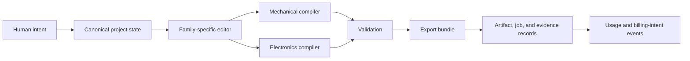

# BreakGen

> A private-alpha studio for turning programmable hardware intent into revisioned product state, validation records, and export bundles.

BreakGen started as an NYU ITP thesis project about custom mechanical keyboards. The current product direction is broader and more useful: help makers, hardware founders, designers, and creative technologists move from a described physical control surface to structured build evidence without stitching together CAD, EDA, firmware, and fabrication tools by hand.

The important product idea is not "AI generates hardware." BreakGen keeps AI at the appearance and exploration layer, then uses deterministic compilers for the engineering layer: geometry, electronics metadata, validation, firmware-facing maps, artifacts, and export manifests.

## Current MVP

BreakGen is now an authenticated private-alpha product studio with a FastAPI backend and React workspace.

Reviewer-facing alpha scope is deliberately tiered:

- `keyboard`: safest path with the deepest current compiler, validation, electronics, and export evidence
- `macropad` and `streamdeck`: alpha paths that reuse much of the control-surface proof stack while artifact coverage matures
- `midi` and `gamepad`: proof paths for validating layout and mapping workflows before making fabrication-complete claims

Implemented proof templates also exist for `pedal_controller`, `breath_controller`, and `handheld_companion`, but those are intentionally marked as proof-stage paths rather than default reviewer-facing product scope.

## Why It Matters

The existing custom-device workflow is fragmented. A small programmable object can require layout tools, CAD, PCB tooling, firmware configuration, slicers, fabrication portals, and manual version tracking. BreakGen treats that fragmentation as the product problem.

The MVP focuses on one narrow promise:

> A user should be able to create a constrained programmable device, edit its authored state, compile evidence from that state, validate the result, and export a traceable bundle tied to a specific revision.

## What Works Now

- Authenticated project creation and listing
- Product domains, families, templates, and hardware module manifests
- Canonical project state with immutable revision snapshots
- Optimistic locking for spec-changing mutations
- Electronics compilation for keyboard, macro pad, stream deck, MIDI, gamepad, and proof-stage control families
- Family-aware mechanical panel outputs and handheld shell proof outputs
- Validation reports tied to project revisions
- Durable artifact and job records
- Evidence ledger API and UI showing revision-linked artifacts, short SHA-256s, readiness, and export caveats
- Deterministic first-run template proposals and a one-click sample Stream Deck project
- Visible autonomy labels for appearance assets: proposed, in-build, rejected, and provider source
- Funnel telemetry for activation, export, revision depth, billing intent, and time-to-first-bundle
- Artifact storage abstraction with local private-alpha mode and R2 configuration guardrails
- Usage-event and billing-intent telemetry for activation/pricing research without billing users
- Export bundles with manifests, build guides, checksums, validation lineage, and QMK/VIA-compatible firmware metadata
- Private-alpha signup controls, seeded reviewer accounts, and JWT auth
- Public client-only demo for browsing the product model
- Deterministic reviewer proof command that creates a real Stream Deck project, compiles it, validates it, and exports a ZIP bundle

## Reviewer Proof

From the repo root:

```bash
make demo-proof
```

That command creates a deterministic `yc_proof_streamdeck` project, compiles electronics and mechanical artifacts, runs validation, exports a bundle, and prints the bundle path plus SHA-256 provenance.

The public client also exposes a checked-in proof snapshot for reviewers:

- `/proof/yc-proof-streamdeck-summary.json`
- `/proof/manifest.json`
- `/proof/validation_report.json`
- `/proof/BUILD_GUIDE.md`

Example output:

```text
BreakGen YC proof complete
project: yc_proof_streamdeck (streamdeck)
revision: r2 status=validated
electronics: physical_rows 14/26 GPIO target=hid_control_surface
mechanical: panel artifacts=mech_panel_dxf_r2, mech_panel_summary_r2
validation: pass checks=10 warnings=0
export: bundle_... readiness=review_ready sha256=...
```

The export line means BreakGen produced a revision-linked, review-ready evidence
bundle. It is not a fabrication-complete package yet; project status remains
`validated` until future Gerber, supplier BOM, enclosure STL, and assembly
outputs are complete enough to support fabrication claims.

Firmware files in the bundle are QMK/VIA-compatible JSON metadata for external
toolchains. They are not compiled firmware binaries.

## Local Development

Install dependencies:

```bash
make install
```

Seed a reviewer account:

```bash
BREAKGEN_ALPHA_PASSWORD="replace-with-a-strong-local-password" make seed-alpha-user
```

Run the full local stack:

```bash
make dev
```

Expected local URLs:

- frontend: [http://localhost:5173](http://localhost:5173)
- backend: [http://localhost:8000](http://localhost:8000)
- API docs: [http://localhost:8000/docs](http://localhost:8000/docs)

## Production Guardrails

Local defaults are private-alpha development defaults, not deployment defaults. When
`BREAKGEN_DEBUG=false`, BreakGen rejects the default JWT secret, wildcard
credentialed CORS, SQLite database URLs, and incomplete R2 artifact-storage
configuration. Production deploys should provide a real database, explicit
origins, durable artifact storage with backups, and an operator-owned secrets
path before accepting public traffic.

## Verification

Before handing a build to a reviewer:

```bash
make demo-proof
./server/.venv/bin/pytest server/tests
cd client && pnpm build
```

## System Shape


```mermaid
flowchart LR
    A["Human intent"] --> B["Canonical project state"]
    B --> C["Family-specific editor"]
    C --> D["Mechanical compiler"]
    C --> E["Electronics compiler"]
    D --> F["Validation"]
    E --> F
    F --> G["Export bundle"]
    G --> H["Artifact, job, and evidence records"]
    H --> I["Usage and billing-intent events"]
```

## Engineering Principles

- The canonical project record is the source of truth.
- Spec-changing edits create immutable revisions.
- Derived work creates artifact and job records tied to a revision.
- AI-generated assets are not canonical until explicitly accepted.
- Fabrication claims must match the actual bundle contents and validation checks.
- Shared platform services must remain product-family-safe, not keyboard-only.

## Honest Limits

BreakGen is not yet a general-purpose hardware factory.

Current gaps that still need product work:

- Provisioned hosted production deployment
- Async worker infrastructure for long-running generation and compile jobs
- Deeper CAD and enclosure outputs beyond panel and shell proof artifacts
- Fabrication partner presets and physical calibration data
- Paid billing, team workflows, and production observability
- Full self-serve onboarding beyond the private-alpha reviewer path

## Repository Map

- [server/](server/): FastAPI backend, compilers, validation, artifacts, auth, and tests
- [client/](client/): React workspace, public demo, authenticated alpha UI
- [docs/PRIVATE_ALPHA_RUNBOOK.md](docs/PRIVATE_ALPHA_RUNBOOK.md): reviewer and operator runbook
- [docs/HOSTED_ALPHA_DEPLOYMENT.md](docs/HOSTED_ALPHA_DEPLOYMENT.md): Fly/Postgres/R2 hosted-alpha deployment runbook
- [docs/STARTUP_OPERATING_SYSTEM.md](docs/STARTUP_OPERATING_SYSTEM.md): YC/startup execution plan and company operating cadence
- [docs/FINANCE_AND_OPS_MODEL.md](docs/FINANCE_AND_OPS_MODEL.md): finance, pricing, private-alpha ops, and cost discipline
- [docs/TECHNOLOGY_AND_MONETIZATION_PLAN.md](docs/TECHNOLOGY_AND_MONETIZATION_PLAN.md): free-tier stack, paid plans, billing, CAD/EDA, storage, and fabrication integrations
- [docs/LAUNCH_ANALYTICS_COMMUNITY_PLAN.md](docs/LAUNCH_ANALYTICS_COMMUNITY_PLAN.md): public launch funnel, analytics events, waitlist capture, and Discord community setup
- [docs/HARDWARE_SOURCE_CATALOG.md](docs/HARDWARE_SOURCE_CATALOG.md): source-backed keyboard/PCB footprint catalog and readiness tiers
- [docs/MANUFACTURED_PRODUCTS_AND_KICKSTARTER_PLAN.md](docs/MANUFACTURED_PRODUCTS_AND_KICKSTARTER_PLAN.md): coming-soon manufactured product lanes and prototype-backed Kickstarter plan
- [PRODUCT.md](PRODUCT.md): product context and positioning
- [DESIGN.md](DESIGN.md): interface and brand direction
- [PRODUCT_SPEC.md](PRODUCT_SPEC.md): longer-form architecture and product specification

## License

MIT
